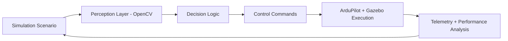

## Hi there 👋

<!--
**gulheda/gulheda** is a ✨ _special_ ✨ repository because its `README.md` (this file) appears on your GitHub profile.

Here are some ideas to get you started:

- 🔭 I’m currently working on ...
- 🌱 I’m currently learning ...
- 👯 I’m looking to collaborate on ...
- 🤔 I’m looking for help with ...
- 💬 Ask me about ...
- 📫 How to reach me: ...
- 😄 Pronouns: ...
- ⚡ Fun fact: ...
-->

  
  
  

---

## ⚔️ Professional Profile
I build autonomous intelligence pipelines where **AI perception**, **real-time decision logic**, and **simulation-first engineering** come together.  
My focus is not only model output—it is **mission reliability**: robust behavior under uncertainty, deterministic control loops, and testable autonomy before hardware deployment.

I am currently shaping my engineering path toward **defense-grade autonomous systems**, with UAV simulation and vision-based navigation at the core.

---

## 🔬 Current Focus (Active Engineering)
- Developing a **UAV digital test environment** using **ArduPilot SITL + Gazebo**
- Integrating **computer vision signals** into autonomy decision loops
- Building telemetry evaluation workflows with **Python + Pandas**
- Improving Linux-native reproducibility for repeatable simulation experiments

---

## 🧰 Technical Stack

### Languages & Data

### AI / Vision

### Autonomy & Simulation

### Systems Engineering

---

## 🚁 Featured Project Tracks
### 1) Autonomous UAV Simulation Platform
- End-to-end simulation workflow for mission rehearsal
- Scenario-based evaluation for tracking, stabilization, and fault tolerance
- Structured for rapid iteration before real-world deployment

### 2) Vision-Guided Navigation Pipeline
- OpenCV-based perception modules for scene understanding
- Feature extraction and environmental interpretation for autonomous routing
- Gradual coupling of perception outputs with control decisions

### 3) Mission Telemetry Intelligence
- Post-run analytics with Python/Pandas
- KPI-oriented evaluation: response stability, path efficiency, control consistency
- Data-driven optimization loop for autonomy performance

---

## 🧠 Advanced Technical Interests
- Autonomous decision architectures in uncertain and adversarial conditions
- Perception-to-control latency optimization
- Sensor fusion and robust state estimation
- Simulation-to-reality transfer methodologies
- Verification, safety constraints, and trust in mission-critical autonomy

---

## 📊 GitHub Intelligence Panel

  
  

  

  

---

## 🤝 Contact

  
  
  

---

### "Engineering autonomy with precision, accountability, and mission focus."

